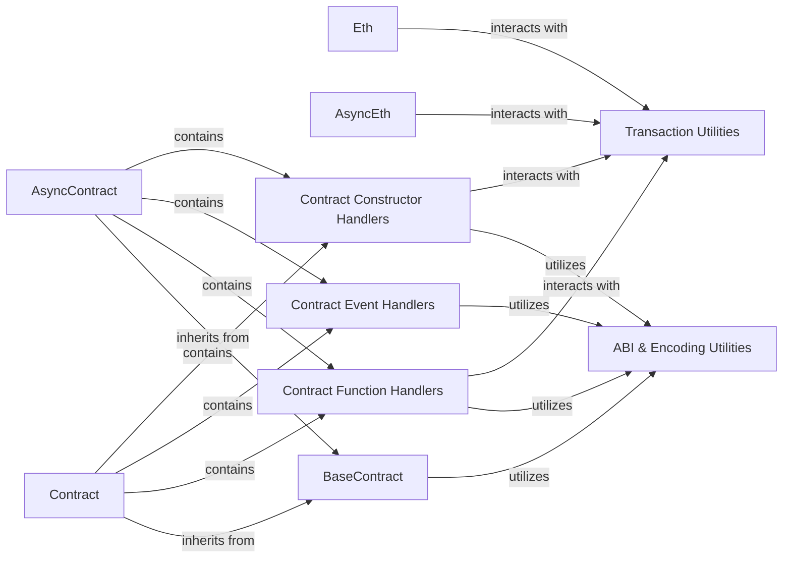

## Component Details

This layer serves as the primary interface for applications to interact with the Ethereum blockchain, encompassing both direct RPC communication and high-level smart contract interactions. It abstracts away the complexities of blockchain protocols, transaction management, and ABI encoding/decoding, providing a Pythonic interface for developers.

### Eth

The core synchronous module for direct interaction with the Ethereum blockchain via RPC calls. It provides methods for querying blockchain state (e.g., `getBlock`, `getBalance`), sending raw transactions, and managing accounts. It acts as a direct wrapper around Ethereum RPC API calls.

**Related Classes/Methods**:

- <a href="https://github.com/ethereum/web3.py/blob/master/web3/eth/eth.py#L1-L1" target="_blank" rel="noopener noreferrer">`Eth` (1:1)</a>

### AsyncEth

The asynchronous counterpart to `Eth`, offering non-blocking methods for the same functionalities. It is crucial for applications requiring concurrent operations or improved performance in I/O-bound scenarios.

**Related Classes/Methods**:

- <a href="https://github.com/ethereum/web3.py/blob/master/web3/eth/async_eth.py#L119-L815" target="_blank" rel="noopener noreferrer">`AsyncEth` (119:815)</a>

### Contract

The synchronous, object-oriented interface for interacting with deployed smart contracts. It simplifies ABI encoding/decoding, allowing users to call contract functions, send transactions to contract methods, and interact with contract events as if they were regular Python object methods.

**Related Classes/Methods**:

- <a href="https://github.com/ethereum/web3.py/blob/master/web3/contract/contract.py#L1-L1" target="_blank" rel="noopener noreferrer">`Contract` (1:1)</a>

### AsyncContract

The asynchronous equivalent of `Contract`, providing non-blocking interaction with smart contracts. It mirrors the functionality of `Contract` but uses asynchronous methods, enabling efficient interaction in asynchronous environments.

**Related Classes/Methods**:

- <a href="https://github.com/ethereum/web3.py/blob/master/web3/contract/async_contract.py#L1-L1" target="_blank" rel="noopener noreferrer">`AsyncContract` (1:1)</a>

### BaseContract

An abstract base class that forms the foundation for both `Contract` and `AsyncContract`. It encapsulates common logic, attributes, and utility methods shared between synchronous and asynchronous contract interactions, promoting code reusability and consistency.

**Related Classes/Methods**:

- <a href="https://github.com/ethereum/web3.py/blob/master/web3/contract/base_contract.py#L1-L1" target="_blank" rel="noopener noreferrer">`BaseContract` (1:1)</a>

### ABI & Encoding Utilities

These modules are central to handling the Ethereum Application Binary Interface (ABI). They provide functionalities for encoding Python data types into their Ethereum ABI counterparts and decoding blockchain data back into Python, enabling seamless communication with smart contracts. They are implicitly utilized by all contract-related modules.

**Related Classes/Methods**:

- <a href="https://github.com/ethereum/web3.py/blob/master/web3/_utils/abi.py#L1-L1" target="_blank" rel="noopener noreferrer">`web3._utils.abi` (1:1)</a>

- <a href="https://github.com/ethereum/web3.py/blob/master/web3/_utils/encoding.py#L1-L1" target="_blank" rel="noopener noreferrer">`web3._utils.encoding` (1:1)</a>

### Contract Function Handlers

These components manage and expose the callable functions of a smart contract. They dynamically create attributes for each contract function defined in the ABI, allowing for intuitive method calls (e.g., `contract.functions.myFunction()`).

**Related Classes/Methods**:

- `ContractFunctions` (1:1)

- `AsyncContractFunctions` (1:1)

### Contract Event Handlers

These components handle interaction with smart contract events. They allow users to create event filters and retrieve logs, simplifying the process of monitoring and reacting to on-chain events.

**Related Classes/Methods**:

- `ContractEvents` (1:1)

- `AsyncContractEvents` (1:1)

### Contract Constructor Handlers

These components manage the deployment of new smart contracts. They encapsulate the logic for building and sending the transaction that creates a new contract instance on the blockchain.

**Related Classes/Methods**:

- `ContractConstructor` (1:1)

- `AsyncContractConstructor` (1:1)

### Transaction Utilities

These utility modules provide common functionalities for handling Ethereum transactions, including transaction validation, filling default values, and managing transaction replacement logic. They are essential for both direct `Eth` interactions and contract method calls that involve sending transactions.

**Related Classes/Methods**:

- <a href="https://github.com/ethereum/web3.py/blob/master/web3/_utils/transactions.py#L1-L1" target="_blank" rel="noopener noreferrer">`web3._utils.transactions` (1:1)</a>

- <a href="https://github.com/ethereum/web3.py/blob/master/web3/_utils/async_transactions.py#L1-L1" target="_blank" rel="noopener noreferrer">`web3._utils.async_transactions` (1:1)</a>

### [FAQ](https://github.com/CodeBoarding/GeneratedOnBoardings/tree/main?tab=readme-ov-file#faq)