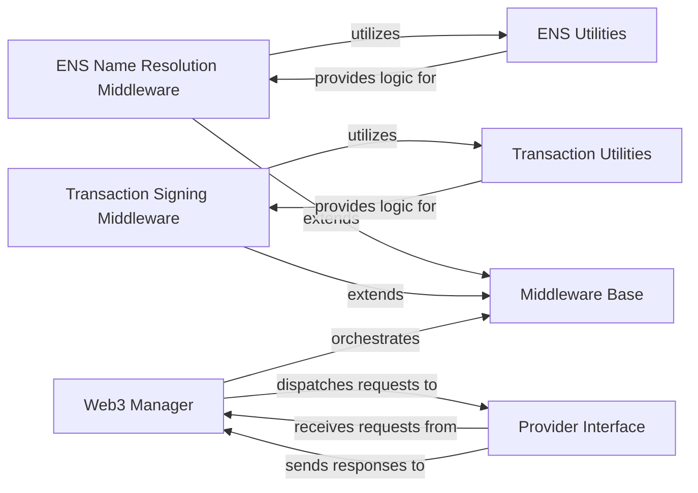

## Component Details

The `Middleware System` in `web3.py` is a crucial architectural component designed to intercept and modify RPC requests and responses, providing a flexible and extensible pipeline for blockchain interactions. It allows for the injection of custom logic without altering the core functionalities of `web3.py`.

### Middleware Base

This is the abstract foundation (`Web3Middleware`) for all middleware in `web3.py`. It defines the core structure and methods (`wrap_make_request`, `wrap_make_batch_request`, `request_processor`, `response_processor`) that allow concrete middleware implementations to inject logic before and after an RPC call. It's fundamental because it establishes the extensible architecture, providing the necessary hooks for interception and ensuring a consistent interface for all middleware.

**Related Classes/Methods**:

- <a href="https://github.com/ethereum/web3.py/blob/master/web3/middleware/base.py#L1-L1" target="_blank" rel="noopener noreferrer">`web3.middleware.base.Web3Middleware` (1:1)</a>

- <a href="https://github.com/ethereum/web3.py/blob/master/web3/middleware/base.py#L1-L1" target="_blank" rel="noopener noreferrer">`web3.middleware.base.Web3Middleware:wrap_make_request` (1:1)</a>

- <a href="https://github.com/ethereum/web3.py/blob/master/web3/middleware/base.py#L1-L1" target="_blank" rel="noopener noreferrer">`web3.middleware.base.Web3Middleware:wrap_make_batch_request` (1:1)</a>

- <a href="https://github.com/ethereum/web3.py/blob/master/web3/middleware/base.py#L1-L1" target="_blank" rel="noopener noreferrer">`web3.middleware.base.Web3Middleware:request_processor` (1:1)</a>

- <a href="https://github.com/ethereum/web3.py/blob/master/web3/middleware/base.py#L1-L1" target="_blank" rel="noopener noreferrer">`web3.middleware.base.Web3Middleware:response_processor` (1:1)</a>

### ENS Name Resolution Middleware

A concrete middleware implementation that extends `Web3Middleware`. Its primary responsibility is to intercept RPC requests, identify parameters that might contain Ethereum Name Service (ENS) names, and resolve them to their corresponding blockchain addresses using ENS Utilities before the request is sent to the node. This is fundamental for user experience, allowing human-readable names instead of raw addresses.

**Related Classes/Methods**: _None_

### Transaction Signing Middleware

A concrete middleware that handles the automatic filling of missing transaction parameters (e.g., gas, nonce) and the signing of `eth_sendTransaction` requests with a private key. It then transforms the request into `eth_sendRawTransaction` with the signed raw transaction. This component is fundamental for developer convenience and security, automating a complex and error-prone process.

**Related Classes/Methods**: _None_

### Transaction Utilities

This component comprises helper functions (e.g., `fill_transaction_defaults`, `fill_nonce`) located in `web3._utils.transactions`. These utilities are crucial for preparing Ethereum transactions by populating default values and managing the transaction nonce. They are fundamental as they encapsulate reusable logic, preventing code duplication and ensuring consistent transaction preparation.

**Related Classes/Methods**:

- <a href="https://github.com/ethereum/web3.py/blob/master/web3/_utils/transactions.py#L112-L145" target="_blank" rel="noopener noreferrer">`web3._utils.transactions.fill_transaction_defaults` (112:145)</a>

- <a href="https://github.com/ethereum/web3.py/blob/master/web3/_utils/transactions.py#L98-L108" target="_blank" rel="noopener noreferrer">`web3._utils.transactions.fill_nonce` (98:108)</a>

### ENS Utilities

This component includes utility functions like `abi_ens_resolver` (from `web3._utils.normalizers`) and `abi_request_formatters` (from `web3._utils.rpc_abi`). These functions are used for resolving ENS names to addresses and applying ABI-based formatting to RPC request parameters. They are fundamental for the practical implementation of ENS resolution, translating human-readable names into blockchain-compatible addresses.

**Related Classes/Methods**:

- <a href="https://github.com/ethereum/web3.py/blob/master/web3/_utils/normalizers.py#L208-L236" target="_blank" rel="noopener noreferrer">`web3._utils.normalizers.abi_ens_resolver` (208:236)</a>

- <a href="https://github.com/ethereum/web3.py/blob/master/web3/_utils/rpc_abi.py#L1-L1" target="_blank" rel="noopener noreferrer">`web3._utils.rpc_abi.abi_request_formatters` (1:1)</a>

### Web3 Manager

The `Manager` class is central to the `web3.py` client's operation, acting as the orchestrator for RPC requests. It is responsible for applying the configured middleware pipeline to incoming requests before dispatching them to the `Provider Interface` and processing responses. It is fundamental as the central control point, tying together the user's interaction, the middleware pipeline, and the blockchain provider.

**Related Classes/Methods**:

- <a href="https://github.com/ethereum/web3.py/blob/master/web3/manager.py#L1-L1" target="_blank" rel="noopener noreferrer">`web3.manager.Manager` (1:1)</a>

### Provider Interface

This component defines the abstract interface (`BaseProvider`) for various blockchain node providers (e.g., HTTP, IPC, WebSocket). It is responsible for the actual low-level communication with the Ethereum node, sending RPC requests, and receiving responses. The middleware pipeline operates *before* requests reach this interface and *after* responses are received from it. It is fundamental because it abstracts away communication details, providing a consistent way to interact with the network.

**Related Classes/Methods**:

- <a href="https://github.com/ethereum/web3.py/blob/master/web3/providers/base.py#L58-L130" target="_blank" rel="noopener noreferrer">`web3.providers.base.BaseProvider` (58:130)</a>

### [FAQ](https://github.com/CodeBoarding/GeneratedOnBoardings/tree/main?tab=readme-ov-file#faq)