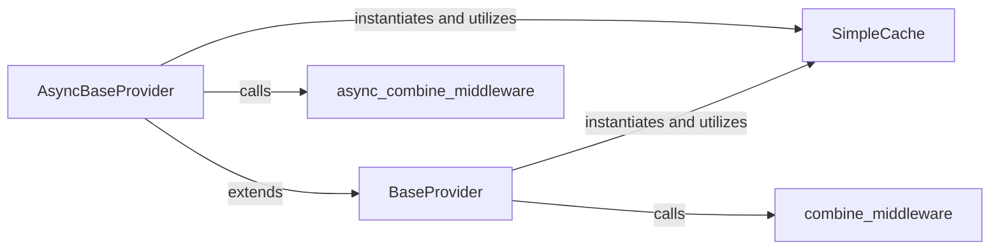

## Component Details

The `Provider Interface` subsystem in `web3.py` is crucial for abstracting the communication layer with Ethereum nodes. It defines the fundamental contracts for both synchronous and asynchronous interactions, enabling various transport mechanisms (like HTTP, IPC, WebSockets) to connect and exchange RPC messages. This subsystem is designed for extensibility through a middleware pipeline and optimizes performance with a caching mechanism.

### BaseProvider

This is the abstract base class (`web3.providers.base.BaseProvider`) that establishes the synchronous contract for all Web3 providers. It defines the essential methods for connecting to an Ethereum node (`is_connected`) and making RPC requests (`make_request`). It also integrates a caching mechanism (`_request_cache`) and a synchronous middleware pipeline, which are crucial for processing requests and responses. `BaseProvider` is fundamental because it sets the standard for synchronous interaction with Ethereum nodes, ensuring consistency across various synchronous provider implementations.

**Related Classes/Methods**:

- <a href="https://github.com/ethereum/web3.py/blob/master/web3/providers/base.py#L58-L130" target="_blank" rel="noopener noreferrer">`web3.providers.base.BaseProvider` (58:130)</a>

- <a href="https://github.com/ethereum/web3.py/blob/master/web3/providers/base.py#L129-L130" target="_blank" rel="noopener noreferrer">`web3.providers.base.BaseProvider:is_connected` (129:130)</a>

- <a href="https://github.com/ethereum/web3.py/blob/master/web3/providers/base.py#L126-L127" target="_blank" rel="noopener noreferrer">`web3.providers.base.BaseProvider:make_request` (126:127)</a>

- <a href="https://github.com/ethereum/web3.py/blob/master/web3/providers/base.py#L101-L124" target="_blank" rel="noopener noreferrer">`web3.providers.base.BaseProvider:request_func` (101:124)</a>

### AsyncBaseProvider

This abstract base class (`web3.providers.async_base.AsyncBaseProvider`) extends `BaseProvider` to define the asynchronous contract for Web3 providers. It supports `asyncio`-based operations for handling RPC requests (`async_make_request`) and integrates an asynchronous middleware pipeline. `AsyncBaseProvider` is fundamental as it provides the necessary interface for non-blocking, asynchronous communication with Ethereum nodes, which is vital for modern high-performance applications.

**Related Classes/Methods**:

- <a href="https://github.com/ethereum/web3.py/blob/master/web3/providers/async_base.py#L72-L181" target="_blank" rel="noopener noreferrer">`web3.providers.async_base.AsyncBaseProvider` (72:181)</a>

- <a href="https://github.com/ethereum/web3.py/blob/master/web3/providers/async_base.py#L0-L0" target="_blank" rel="noopener noreferrer">`web3.providers.async_base.AsyncBaseProvider:async_make_request` (0:0)</a>

- <a href="https://github.com/ethereum/web3.py/blob/master/web3/providers/async_base.py#L0-L0" target="_blank" rel="noopener noreferrer">`web3.providers.async_base.AsyncBaseProvider:async_is_connected` (0:0)</a>

- <a href="https://github.com/ethereum/web3.py/blob/master/web3/providers/async_base.py#L113-L128" target="_blank" rel="noopener noreferrer">`web3.providers.async_base.AsyncBaseProvider:request_func` (113:128)</a>

### SimpleCache

A basic, in-memory caching utility implemented using `collections.OrderedDict`. It is directly utilized by both `BaseProvider` and `AsyncBaseProvider` to store and retrieve RPC request responses. This component is fundamental because it significantly improves the performance of the provider interface by reducing redundant network calls for frequently requested data, thereby optimizing interaction with the Ethereum node.

**Related Classes/Methods**:

- <a href="https://github.com/ethereum/web3.py/blob/master/web3/_utils/caching/caching_utils.py#L0-L0" target="_blank" rel="noopener noreferrer">`web3._utils.caching.caching_utils.SimpleCache` (0:0)</a>

### combine_middleware

A utility function (`web3.middleware.base.combine_middleware`) that takes a sequence of synchronous middleware functions and a base provider request function, then wraps them into a single callable. This function orchestrates the flow of RPC requests and responses through the synchronous middleware chain, allowing each middleware to process the data before and after the actual request is made. It is fundamental because it enables the flexible and modular extension of provider behavior without altering the core provider logic.

**Related Classes/Methods**:

- <a href="https://github.com/ethereum/web3.py/blob/master/web3/middleware/base.py#L0-L0" target="_blank" rel="noopener noreferrer">`web3.middleware.base.combine_middleware` (0:0)</a>

### async_combine_middleware

The asynchronous counterpart to `combine_middleware`. This utility function (`web3.middleware.base.async_combine_middleware`) composes a chain of asynchronous middleware functions around an `async_provider_request_fn`. It manages the asynchronous flow of RPC requests and responses through the middleware, ensuring non-blocking execution. This component is fundamental for enabling asynchronous extensibility and custom logic within the `AsyncBaseProvider`.

**Related Classes/Methods**:

- <a href="https://github.com/ethereum/web3.py/blob/master/web3/middleware/base.py#L0-L0" target="_blank" rel="noopener noreferrer">`web3.middleware.base.async_combine_middleware` (0:0)</a>

### [FAQ](https://github.com/CodeBoarding/GeneratedOnBoardings/tree/main?tab=readme-ov-file#faq)