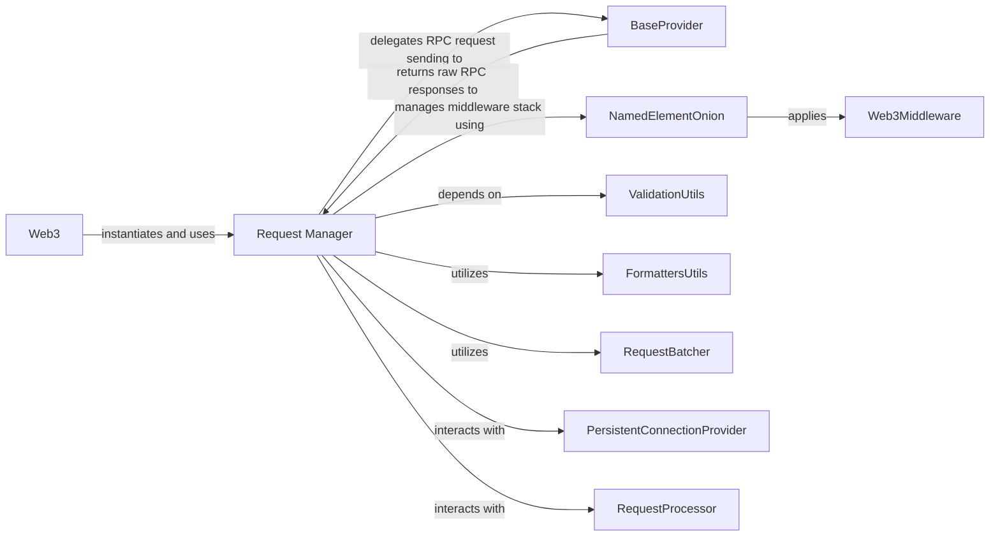

## Component Details

The central orchestrator for all RPC communications within `web3.py`. It manages the lifecycle of requests and responses, dispatching them to the underlying `Provider Interface`, and applying the `Middleware System` to both requests and responses. It ensures proper formatting, processing, and handling of all interactions with the Ethereum node, acting as the crucial intermediary between the high-level API and the network layer.

### Request Manager

The central orchestrator for all RPC communications within `web3.py`. It manages the lifecycle of requests and responses, dispatching them to the underlying `Provider Interface`, and applying the `Middleware System` to both requests and responses. It ensures proper formatting, processing, and handling of all interactions with the Ethereum node, acting as the crucial intermediary between the high-level API and the network layer.

**Related Classes/Methods**:

- `Request Manager` (0:0)

### BaseProvider

Defines the abstract interface for all concrete providers, enabling the `Request Manager` to send RPC requests to the Ethereum node. It's a crucial abstraction that allows `Request Manager` to interact with various network layers (e.g., HTTP, IPC, WebSocket) without knowing their specific implementations.

**Related Classes/Methods**:

- `BaseProvider` (0:0)

### NamedElementOnion

A specialized data structure used by the `Request Manager` to manage and apply the ordered stack of middleware. It ensures that middleware functions are executed in the correct sequence for both incoming requests and outgoing responses.

**Related Classes/Methods**:

- `NamedElementOnion` (0:0)

### Web3Middleware

The base class for all middleware components in `web3.py`. Middleware functions, managed by `NamedElementOnion`, intercept and transform RPC requests before they are sent to the provider and responses before they are returned to the caller, allowing for functionalities like gas price strategies, ENS resolution, and validation.

**Related Classes/Methods**:

- `Web3Middleware` (0:0)

### ValidationUtils

Provides utility functions for validating RPC responses received from the Ethereum node. The `Request Manager` utilizes these utilities to ensure the integrity and correctness of the data before further processing or returning it to the user.

**Related Classes/Methods**:

- `ValidationUtils` (0:0)

### FormattersUtils

Offers utility functions for formatting and transforming raw RPC data into desired Python structures. The `Request Manager` applies these formatters to make the responses usable and consistent with `web3.py`'s data models.

**Related Classes/Methods**:

- `FormattersUtils` (0:0)

### Web3

The primary entry point for interacting with the Ethereum blockchain in `web3.py`. It instantiates and holds a reference to the `Request Manager`, delegating all RPC communication tasks to it. Modules within `Web3` (e.g., `w3.eth`, `w3.net`) interact directly with the `Request Manager`.

**Related Classes/Methods**:

- <a href="https://github.com/ethereum/web3.py/blob/master/conftest.py#L0-L0" target="_blank" rel="noopener noreferrer">`Web3` (0:0)</a>

### RequestBatcher

A utility class that facilitates the batching of multiple RPC requests into a single network call. The `Request Manager` can leverage this component to optimize network communication by reducing the number of round trips to the Ethereum node.

**Related Classes/Methods**:

- `RequestBatcher` (0:0)

### PersistentConnectionProvider

A specialized type of `BaseProvider` that maintains an open, persistent connection (e.g., WebSockets). The `Request Manager` has specific logic to handle sending and receiving batch and individual requests over these persistent connections, including managing an internal `RequestProcessor` for ordered responses.

**Related Classes/Methods**:

- <a href="https://github.com/ethereum/web3.py/blob/master/web3/_utils/module_testing/persistent_connection_provider.py#L0-L0" target="_blank" rel="noopener noreferrer">`PersistentConnectionProvider` (0:0)</a>

### RequestProcessor

An internal component primarily used by `PersistentConnectionProvider` but directly interacted with by `Request Manager` for managing the lifecycle of requests and responses over persistent connections. It caches request information and processes incoming raw responses, ensuring they are matched with their corresponding requests.

**Related Classes/Methods**:

- <a href="https://github.com/ethereum/web3.py/blob/master/web3/providers/persistent/request_processor.py#L73-L377" target="_blank" rel="noopener noreferrer">`RequestProcessor` (73:377)</a>

### [FAQ](https://github.com/CodeBoarding/GeneratedOnBoardings/tree/main?tab=readme-ov-file#faq)