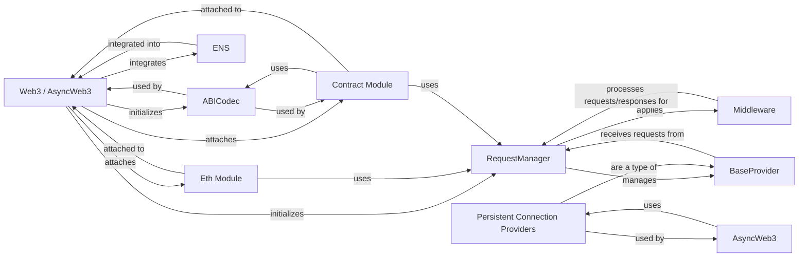

## Component Details

Component Overview: Web3 API Subsystem

### Web3 / AsyncWeb3

These are the primary user-facing interfaces of `web3.py`, providing synchronous (`Web3`) and asynchronous (`AsyncWeb3`) access to the Ethereum blockchain. They act as orchestrators, initializing and connecting various sub-components like the `RequestManager`, `ABICodec`, `ENS`, and specialized modules (Eth, Contract). They are central to all user interactions, aggregating functionalities and exposing a high-level API.

**Related Classes/Methods**:

- <a href="https://github.com/ethereum/web3.py/blob/master/web3/main.py#L378-L443" target="_blank" rel="noopener noreferrer">`web3.main.Web3` (378:443)</a>

- <a href="https://github.com/ethereum/web3.py/blob/master/web3/main.py#L449-L581" target="_blank" rel="noopener noreferrer">`web3.main.AsyncWeb3` (449:581)</a>

### RequestManager

The communication backbone responsible for managing the lifecycle of RPC requests. It formats method calls into JSON-RPC requests, sends them to the `BaseProvider`, and processes responses. It handles both synchronous and asynchronous requests and integrates `Middleware` for request/response processing.

**Related Classes/Methods**:

- <a href="https://github.com/ethereum/web3.py/blob/master/web3/manager.py#L100-L608" target="_blank" rel="noopener noreferrer">`web3.manager.RequestManager` (100:608)</a>

### BaseProvider

An abstract base class defining the interface for connecting to an Ethereum node. Concrete implementations (e.g., `HTTPProvider`, `IPCProvider`, `WebSocketProvider`) handle the specifics of different transport layers. It's crucial for abstracting the underlying communication mechanism.

**Related Classes/Methods**:

- <a href="https://github.com/ethereum/web3.py/blob/master/web3/providers/base.py#L58-L130" target="_blank" rel="noopener noreferrer">`web3.providers.base.BaseProvider` (58:130)</a>

### ABICodec

Responsible for encoding and decoding data according to the Ethereum Application Binary Interface (ABI) specification. This is vital for interacting with smart contracts, ensuring correct serialization of function calls, event logs, and constructor arguments.

**Related Classes/Methods**:

- `web3.abi.codec.ABICodec` (0:0)

### ENS

Provides an interface for interacting with the Ethereum Name Service, allowing resolution of human-readable `.eth` names to blockchain addresses and vice-versa. Both synchronous and asynchronous versions are available.

**Related Classes/Methods**:

- `web3.ens.ens.ENS` (0:0)

- `web3.ens.async_ens.AsyncENS` (0:0)

### Eth Module

Offers a comprehensive set of functions for core Ethereum blockchain interactions, including querying block information, transaction details, account balances, and sending transactions. It's the primary interface for most common blockchain operations.

**Related Classes/Methods**:

- <a href="https://github.com/ethereum/web3.py/blob/master/web3/eth/eth.py#L0-L0" target="_blank" rel="noopener noreferrer">`web3.eth.eth.Eth` (0:0)</a>

- <a href="https://github.com/ethereum/web3.py/blob/master/web3/eth/async_eth.py#L119-L815" target="_blank" rel="noopener noreferrer">`web3.eth.async_eth.AsyncEth` (119:815)</a>

### Contract Module

Provides a high-level, Pythonic interface for interacting with Ethereum smart contracts. It allows loading ABIs, constructing contract instances, calling functions, and listening for events, leveraging `ABICodec` and `RequestManager`.

**Related Classes/Methods**:

- <a href="https://github.com/ethereum/web3.py/blob/master/web3/contract/contract.py#L0-L0" target="_blank" rel="noopener noreferrer">`web3.contract.contract.Contract` (0:0)</a>

- <a href="https://github.com/ethereum/web3.py/blob/master/web3/contract/async_contract.py#L0-L0" target="_blank" rel="noopener noreferrer">`web3.contract.async_contract.AsyncContract` (0:0)</a>

### Middleware

A flexible mechanism to intercept and modify RPC requests and responses. It allows injecting functionalities like gas estimation, transaction signing, and error handling into the request-response pipeline without altering core logic.

**Related Classes/Methods**:

- <a href="https://github.com/ethereum/web3.py/blob/master/conftest.py#L0-L0" target="_blank" rel="noopener noreferrer">`web3.middleware.middleware` (0:0)</a>

### Persistent Connection Providers

Components (e.g., `WebSocketProvider`, `SubscriptionManager`, `PersistentConnection`) that handle long-lived connections, crucial for real-time features like event subscriptions. `SubscriptionManager` specifically manages active subscriptions. Primarily used by `AsyncWeb3`.

**Related Classes/Methods**:

- <a href="https://github.com/ethereum/web3.py/blob/master/web3/providers/persistent/websocket.py#L0-L0" target="_blank" rel="noopener noreferrer">`web3.providers.persistent.websocket` (0:0)</a>

- `web3.providers.persistent.manager` (0:0)

### [FAQ](https://github.com/CodeBoarding/GeneratedOnBoardings/tree/main?tab=readme-ov-file#faq)