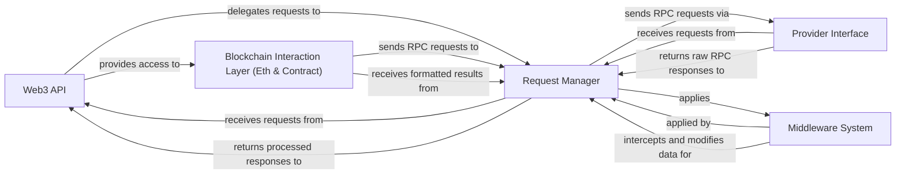

## Component Details

The `web3.py` library is designed with a clear separation of concerns, allowing for modularity, extensibility, and ease of use when interacting with the Ethereum blockchain. The core architecture can be distilled into five fundamental components: the **Web3 API**, the **Request Manager**, the **Provider Interface**, the **Middleware System**, and the **Blockchain Interaction Layer (Eth & Contract)**.

### Web3 API

This is the top-level, user-facing interface of `web3.py`. It serves as the primary entry point for all interactions with the Ethereum blockchain, aggregating various functionalities (Eth, ENS, Contract) and providing a unified, high-level API. It initializes and orchestrates the `Request Manager` and attaches specialized modules, making it the central orchestrator for user-initiated operations.

**Related Classes/Methods**:

- <a href="https://github.com/ethereum/web3.py/blob/master/web3/main.py#L378-L443" target="_blank" rel="noopener noreferrer">`web3.main.Web3` (378:443)</a>

- <a href="https://github.com/ethereum/web3.py/blob/master/web3/main.py#L449-L581" target="_blank" rel="noopener noreferrer">`web3.main.AsyncWeb3` (449:581)</a>

### Request Manager

The central hub for all RPC communication within `web3.py`. It manages the lifecycle of requests and responses, sending them to the underlying `Provider Interface` and applying the `Middleware System` to both requests and responses. It ensures proper formatting, processing, and handling of all interactions with the Ethereum node, acting as the crucial intermediary between the high-level API and the network layer.

**Related Classes/Methods**:

- <a href="https://github.com/ethereum/web3.py/blob/master/web3/manager.py#L100-L608" target="_blank" rel="noopener noreferrer">`web3.manager.RequestManager` (100:608)</a>

### Provider Interface

Defines the abstract contract for connecting to and communicating with an Ethereum node. Concrete implementations (e.g., `HTTPProvider`, `IPCProvider`, `WebSocketProvider`) handle the actual network communication, abstracting away the underlying transport details. It is solely responsible for the raw transmission of RPC requests to the Ethereum node and the reception of raw RPC responses.

**Related Classes/Methods**:

- <a href="https://github.com/ethereum/web3.py/blob/master/web3/providers/base.py#L58-L130" target="_blank" rel="noopener noreferrer">`web3.providers.base.BaseProvider` (58:130)</a>

- <a href="https://github.com/ethereum/web3.py/blob/master/web3/providers/async_base.py#L72-L181" target="_blank" rel="noopener noreferrer">`web3.providers.async_base.AsyncBaseProvider` (72:181)</a>

### Middleware System

A flexible pipeline that intercepts and modifies RPC requests before they are sent to the `Provider Interface` and responses before they are returned to the user. It provides a powerful extension mechanism for `web3.py`, enabling custom logic such as automatic transaction signing, ENS resolution, and gas estimation without altering core functionalities. This system allows for highly customizable and extensible blockchain interactions.

**Related Classes/Methods**:

- <a href="https://github.com/ethereum/web3.py/blob/master/web3/middleware/base.py#L1-L1" target="_blank" rel="noopener noreferrer">`web3.middleware.base.Web3Middleware` (1:1)</a>

- <a href="https://github.com/ethereum/web3.py/blob/master/web3/middleware/signing.py#L1-L1" target="_blank" rel="noopener noreferrer">`web3.middleware.signing.SignAndSendRawMiddlewareBuilder` (1:1)</a>

- <a href="https://github.com/ethereum/web3.py/blob/master/web3/middleware/names.py#L1-L1" target="_blank" rel="noopener noreferrer">`web3.middleware.names.ENSNameToAddressMiddleware` (1:1)</a>

### Blockchain Interaction Layer (Eth & Contract)

This layer provides the core functionalities for interacting directly with the Ethereum blockchain. It encompasses the `EthModule` for direct RPC API calls (e.g., querying blockchain state, sending raw transactions) and the `ContractModule` for object-oriented interaction with smart contracts (handling ABI encoding/decoding, function calls, and event parsing). This layer translates high-level Python operations into blockchain-specific interactions, heavily relying on internal ABI handling utilities (`web3.codec.ABICodec`).

**Related Classes/Methods**:

- <a href="https://github.com/ethereum/web3.py/blob/master/web3/eth/eth.py#L1-L1" target="_blank" rel="noopener noreferrer">`web3.eth.eth.Eth` (1:1)</a>

- <a href="https://github.com/ethereum/web3.py/blob/master/web3/eth/async_eth.py#L119-L815" target="_blank" rel="noopener noreferrer">`web3.eth.async_eth.AsyncEth` (119:815)</a>

- <a href="https://github.com/ethereum/web3.py/blob/master/web3/contract/contract.py#L1-L1" target="_blank" rel="noopener noreferrer">`web3.contract.contract.Contract` (1:1)</a>

- <a href="https://github.com/ethereum/web3.py/blob/master/web3/contract/async_contract.py#L1-L1" target="_blank" rel="noopener noreferrer">`web3.contract.async_contract.AsyncContract` (1:1)</a>

- <a href="https://github.com/ethereum/web3.py/blob/master/conftest.py#L1-L1" target="_blank" rel="noopener noreferrer">`web3.codec.ABICodec` (1:1)</a>

### [FAQ](https://github.com/CodeBoarding/GeneratedOnBoardings/tree/main?tab=readme-ov-file#faq)